# QuantPulse — Architecture Reference

The complete high-level picture: what the system is, what it's built from, and how data
moves through it. Every diagram here reflects code that runs — the numbers were read out
of the running system, not estimated.

This is the **map**. Detail on each component comes later; where a section is deliberately
shallow it says so and points at what will cover it.

**Companion documents**
| | |
|---|---|
| [`decisions/`](decisions/) | design decisions (ADRs) |
| [`RUNBOOK.md`](RUNBOOK.md) | how to run it |

---

## 1. What this is, in one paragraph

QuantPulse ingests market data for the **81 instruments listed on the Casablanca Stock
Exchange**, stores it, and builds four things on top: a live market dashboard, a portfolio
with cost-basis and P&L accounting, a rule-based alerting engine, and a quantitative
analytics layer covering correlation structure, factor analysis, distributional forecasting
and dividend-income projection. Five backend services communicate over RabbitMQ and HTTP;
one Next.js app is the only thing a browser touches.

**The constraint that shaped everything:** the upstream data vendor allows **100 API calls
per day**. Not per minute — per day. That single number drove the quota governor, the
caching strategy, the market-hours scheduler, the priority backfill queue, and the decision
to record fixtures rather than call the API during development.

---

## 2. System context

Who and what the system talks to.

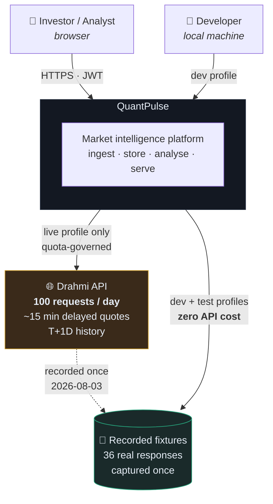

The dashed line matters: fixtures were captured from the live API **once**, deliberately,
and every subsequent development and test run reads them instead. See
[ADR-003](decisions/ADR-003-recorded-fixtures.md).

---

## 3. Container diagram

Every deployable process and datastore.

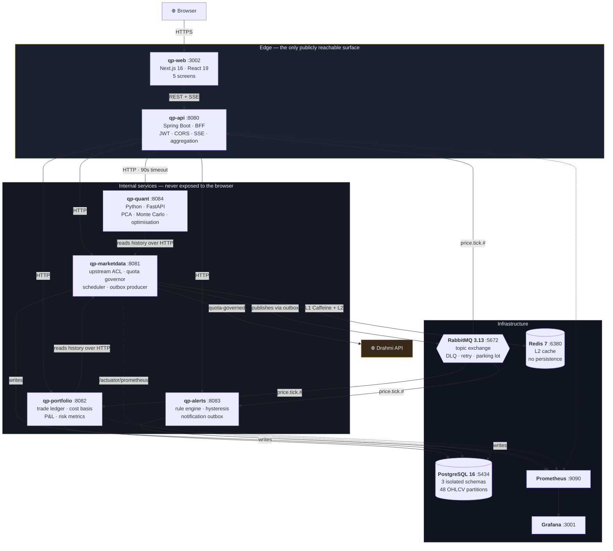

### Why the boundaries fall where they do

| Service | Owns | Rationale |
|---|---|---|
| **qp-marketdata** | The Drahmi integration and all market data | Only component that can spend an API call, so there is exactly **one** place to enforce a budget. Also the sole writer to the `market` schema — no other service can corrupt it. |
| **qp-portfolio** | Money | Everything requiring exact decimal arithmetic and transactional integrity lives here, behind one boundary. |
| **qp-alerts** | Stream processing | Pure consumer of the price stream. Stateless with respect to market data; holds only rules and firing history. |
| **qp-quant** | Numerical analysis | Vectorised linear algebra belongs in NumPy/SciPy, not hand-written Java ([ADR-004](decisions/ADR-004-python-analytics-service.md)). Its seconds-of-CPU workload must not occupy a request thread in an ingestion service. |
| **qp-api** | The browser contract | Authentication, CORS and aggregation in one place instead of four. |

**Note `qp-portfolio → qp-marketdata` is an HTTP arrow, not a database arrow.** It reads
OHLCV over the public API because it physically cannot read the `market` schema — the
`qp_portfolio` role has no grant on it. That's [ADR-002](decisions/ADR-002-schema-per-service.md)
made real:

```
qp_portfolio=> SELECT * FROM market.instrument;
ERROR:  permission denied for schema market
```

---

## 4. Tech stack

### Runtime and build

| Concern | Choice | Why this and not the obvious alternative |
|---|---|---|
| Language (services) | **Java 21 LTS** | Current LTS; records, pattern matching, virtual threads available |
| Framework | **Spring Boot 3.5.3** | The stack banks actually run |
| Build | **Maven multi-module reactor** | Imports Boot's BOM rather than inheriting its parent, so the single `<parent>` slot stays free for a company POM ([ADR-001](decisions/ADR-001-maven-reactor.md)) |
| Language (analytics) | **Python 3.13** | The work is eigendecomposition and Monte Carlo; NumPy/SciPy do it correctly and at BLAS speed |
| Analytics framework | **FastAPI + Uvicorn** | Async I/O for concurrent history fetches; automatic OpenAPI |
| Frontend | **Next.js 16, React 19, Recharts 3** | App Router, server components where useful, client components where interactive |

### Data

| Concern | Choice | Notes |
|---|---|---|
| Database | **PostgreSQL 16** | One instance, three schemas, three login roles, no cross-schema grants |
| Migrations | **Flyway** | Versioned per service; `ddl-auto: validate` so Hibernate checks but never mutates |
| ORM | **Spring Data JPA / Hibernate 6.6** | Bypassed deliberately for bulk writes — see `OhlcvBatchWriter` |
| Time series | **Range partitioning by month** | 48 partitions; BRIN on the time column, B-tree on `(ticker, session_date DESC)` |
| Money type | **`NUMERIC(19,6)`** everywhere | Never `double`. `HALF_EVEN` rounding. A `Money` value type refuses to mix currencies |

### Messaging

| Concern | Choice | Notes |
|---|---|---|
| Broker | **RabbitMQ 3.13** | Topic exchange, hierarchical routing keys |
| Client | **Spring AMQP, declared by hand** | *Not* Spring Cloud Stream — it generated the topology and hid exactly the mechanics worth understanding |
| Delivery | **At-least-once + idempotent consumers** | Exactly-once *effects*, not exactly-once delivery. The distinction matters |
| Reliability | **Transactional outbox** | DB write and event publish commit together; a relay drains it |
| Failure path | **DLX → TTL retry queue → parking lot** | Broker-side delayed retry; no consumer thread blocks on a sleep |

### Resilience and operations

| Concern | Choice | Notes |
|---|---|---|
| Circuit breaking | **Resilience4j 2.3** | Breaker, retry with jitter, time limiter. Quota denial is *excluded* from breaker failures — it's our decision, not an upstream fault |
| Caching | **Caffeine (L1) + Redis (L2)** | TTL matched to the vendor's 15-minute delay. The cache is part of the budget, not an optimisation |
| Scheduling | **`@Scheduled` + ShedLock** | Two instances double-firing wouldn't duplicate work — it would exhaust the daily budget by lunchtime |
| Metrics | **Micrometer → Prometheus → Grafana** | Custom gauges for quota remaining, outbox backlog, SSE subscribers |
| Auth | **Spring Security + JJWT 0.12** | Stateless; CSRF correctly disabled *because* auth is a bearer token |
| Containers | **Docker Compose** | Multi-stage builds, non-root users, `MaxRAMPercentage` for cgroup-aware heap sizing |

### Testing

| Layer | Tooling | Count |
|---|---|---|
| Money & cost basis | JUnit 5 + AssertJ | 25 Java tests |
| Analytics core | pytest | 45 Python tests |
| Integration | Testcontainers + WireMock | *not done yet* |

---

## 5. Workflows

### 5.1 Ingestion cycle — the core loop

Fires every 15 minutes during the Casablanca session. **One API call refreshes all 81
instruments.**

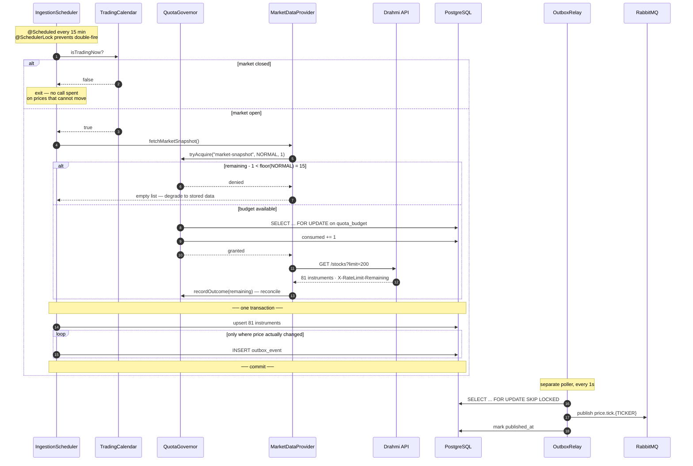

Two details worth noticing:

- **Events are only written when a price actually moved.** Republishing 81 unchanged prices
  every cycle would be pure noise and force every consumer to filter.
- **The outbox row is written in the same transaction as the instrument update.** That's the
  dual-write problem solved — either both land or neither does.

### 5.2 Event fan-out — one publish, three independent consumers

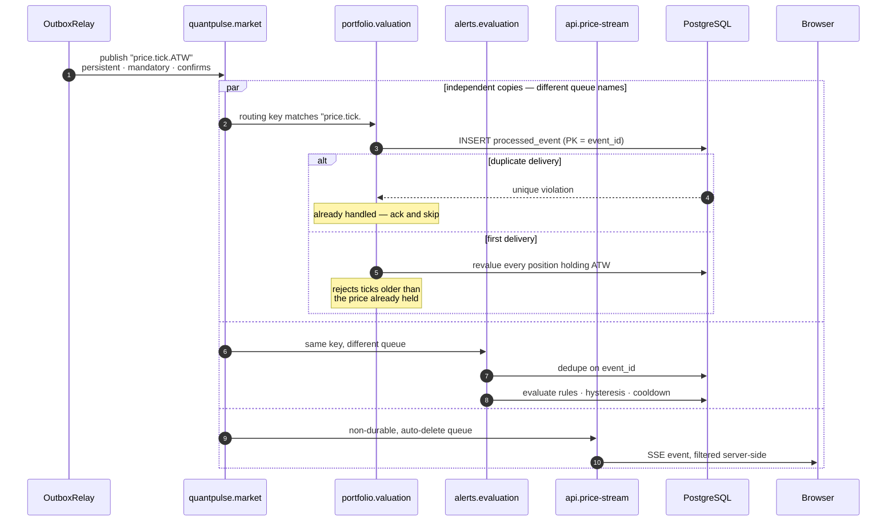

**Same routing key, three different queue names → three full copies.** Had they shared a
queue name they'd be *competing* consumers splitting the stream — same broker, opposite
semantics. That distinction is worth being able to state precisely.

The API's queue is deliberately non-durable: a missed tick there is superseded seconds
later, whereas a missed tick in valuation means a stale position.

### 5.3 The quota decision

Every upstream call passes this gate before a socket opens.

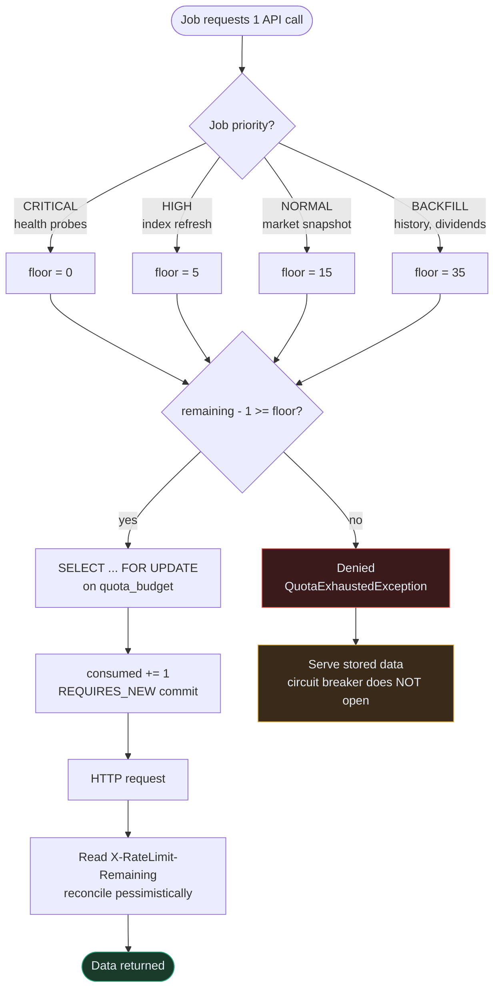

Three decisions embedded here:

1. **Priority floors** stop a backfill loop from starving the next market snapshot. A naive
   `remaining > 0` check would allow exactly that.
2. **`REQUIRES_NEW`** commits the spend independently of the caller's transaction. Once the
   HTTP request leaves, the quota is gone whether or not the ingestion later rolls back.
3. **Quota denial is excluded from circuit-breaker failures.** It's our own decision, not an
   upstream fault; counting it would open the breaker every time the budget ran low.

### 5.4 Dashboard load — BFF aggregation

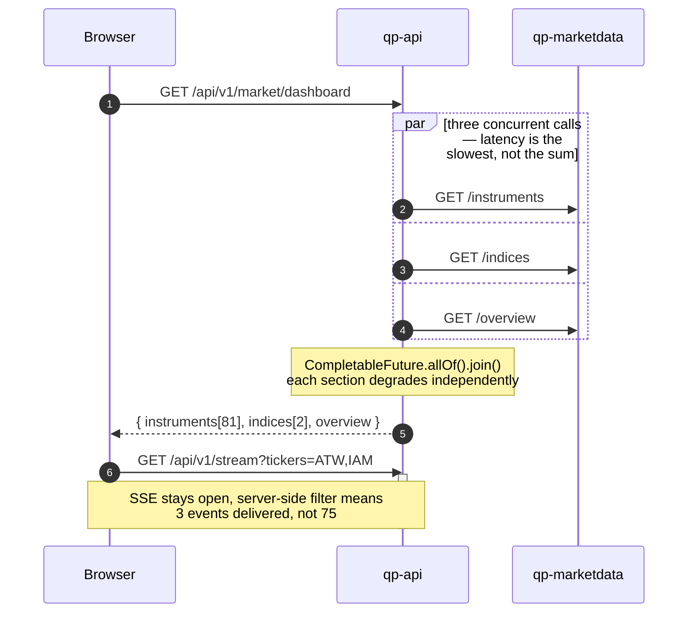

Sequentially this is three round trips of latency; concurrently it's one. And every upstream
call reads **our** database — a dashboard refresh costs zero Drahmi calls, which it must,
or quota consumption would scale with how many browser tabs are open.

### 5.5 Analysis request

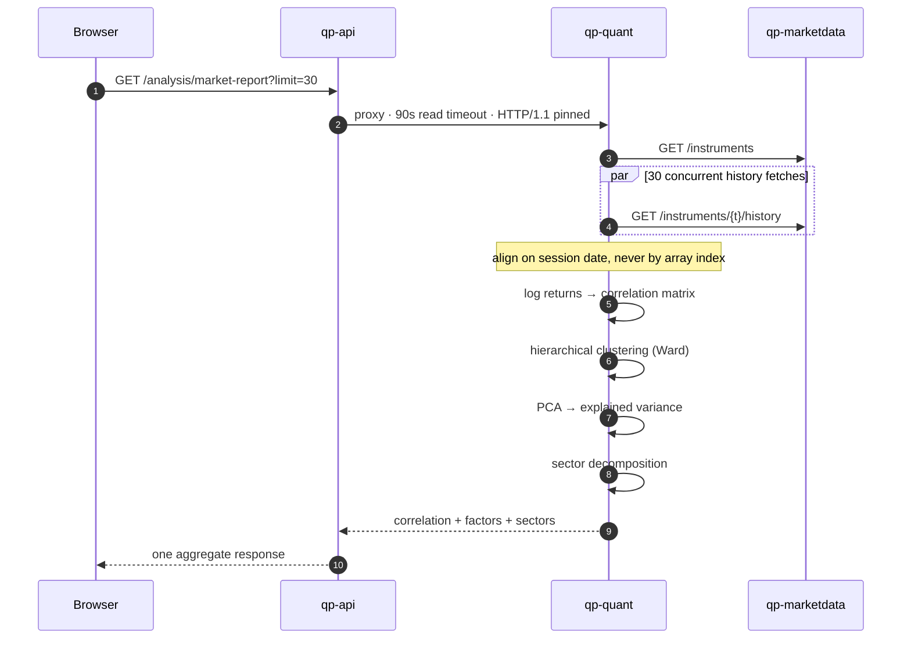

The **90-second read timeout** on the quant client is not cosmetic: a 40×40 correlation
matrix plus a walk-forward backtest is seconds of CPU, and the 5-second timeout used for the
Java services would abort every request.

The **HTTP/1.1 pin** is a real bug fix — see §9.

### 5.6 Dividend income projection

The workflow you're most likely to be asked to walk through, because the analysis is the
interesting part rather than the arithmetic.

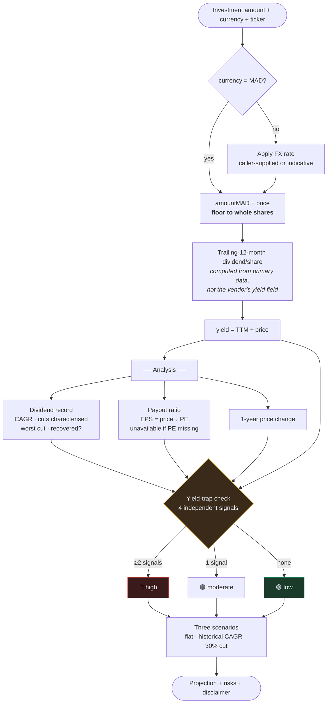

Why it's built this way: **a high yield is usually bad news.** Yield is dividend ÷ price, so
a halved price with an uncut dividend doubles the yield. Screening on yield alone
systematically selects the companies least able to keep paying. The screen proves it on real
data — MNG yields 5.55% while paying out **140% of earnings**.

### 5.7 Backfill queue — spreading expensive work across days

A year of history for 81 instruments costs 81 calls. That doesn't fit in a 100-call day
alongside everything else, so it becomes a durable priority queue.

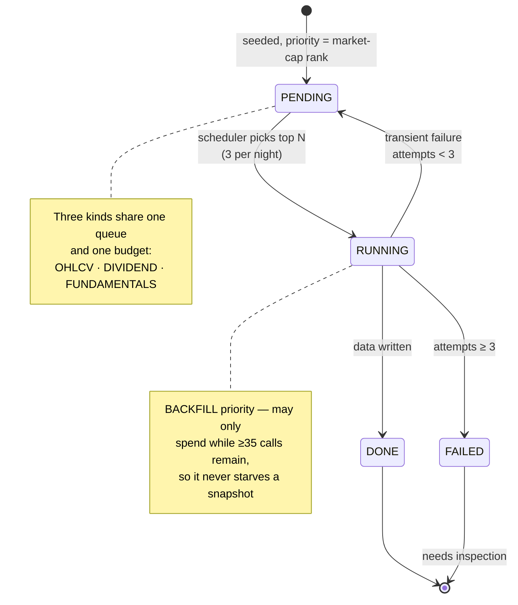

---

## 6. Data model

Three schemas, isolated by PostgreSQL role grants.

### `market` — owned by qp-marketdata

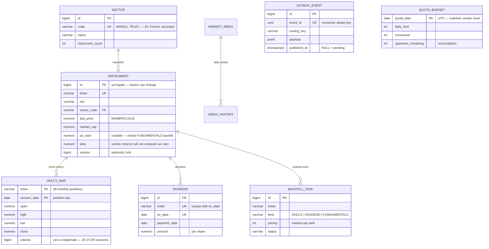

### `portfolio` — owned by qp-portfolio

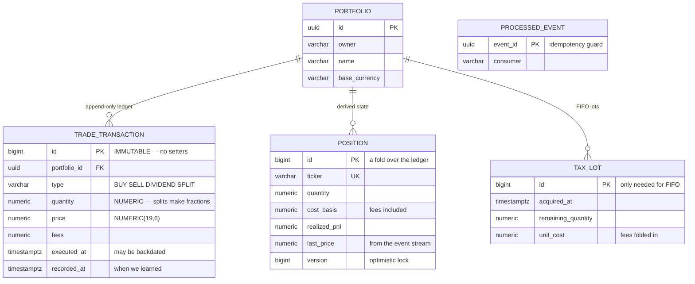

The ledger is **append-only by design**: a correction is a compensating row, never an
`UPDATE`. That makes any historical position reconstructible by replay — which doubles as
the reconciliation tool (`POST /{id}/positions/{ticker}/rebuild`).

### `alerts` — owned by qp-alerts

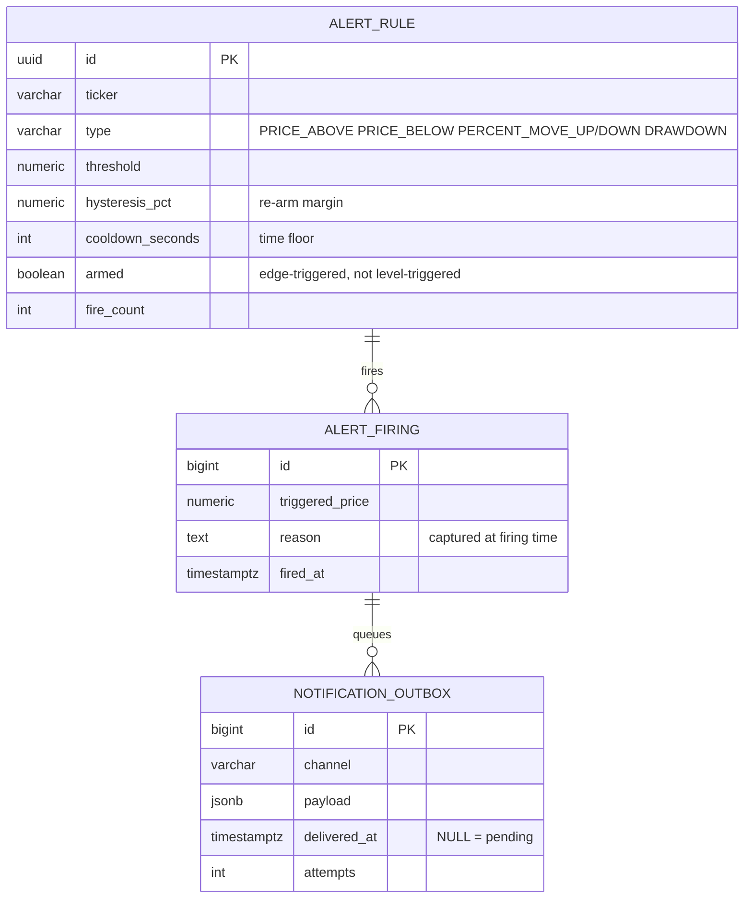

---

## 7. Messaging topology

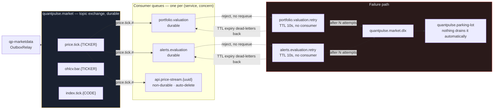

The retry queue **has no consumer**. Messages sit there until their TTL expires, at which
point RabbitMQ dead-letters them *back* to the main queue. That's the standard AMQP
delayed-retry trick — a broker-side sleep costing no consumer thread, unlike blocking in the
listener.

Nothing drains the parking lot automatically. An auto-draining parking lot is just a slower
infinite retry loop; a human inspects it and calls the replay endpoint.

---

## 8. Deployment topology

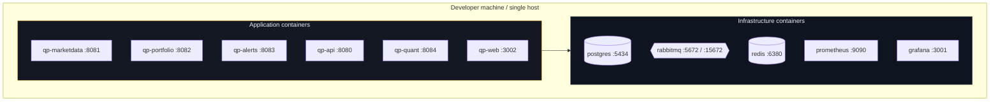

Host ports are deliberately shifted — this machine already runs a Postgres on 5432, a Redis
on 6379, and another project on 3000. Container-internal ports stay standard.

```bash
# Infrastructure only — services from an IDE
cd ops && docker compose --env-file ../.env up -d

# Everything containerised
cd ops && docker compose -f docker-compose.yml -f docker-compose.apps.yml \
                         --env-file ../.env up -d --build
```

Java images are multi-stage (Maven build → JRE-alpine runtime), run as a non-root user, and
size the heap with `-XX:MaxRAMPercentage=70` so the JVM respects the cgroup limit rather than
host memory.

---

## 9. Scheduled work — a day in the life

```mermaid
gantt
    title Daily schedule — times in Africa/Casablanca
    dateFormat HH:mm
    axisFormat %H:%M

    section Overnight
    Nightly job — sectors, market caps, backfill x3   :done, n1, 01:15, 15m

    section Session 09:30–15:30
    Market snapshot + indices, every 15 min           :active, s1, 09:30, 360m

    section Close
    Closing snapshot                                  :crit, c1, 15:45, 10m

    section Continuous
    Outbox relay — every 1s                           :o1, 00:00, 1440m
    Notification dispatch — every 2s                  :o2, 00:00, 1440m
    Quota gauge refresh — every 60s                   :o3, 00:00, 1440m
```

### The budget that makes 100/day work

| Job | Frequency | Calls/day |
|---|---:|---:|
| `/market/status` | 2× daily | 2 |
| `/stocks?limit=200` — **all 81 instruments** | every 15 min, 6h session | 24 |
| `/indices` — all indices | every 15 min during session | 24 |
| `/sectors` | once daily | 1 |
| Movers (market-cap harvest) | once daily, 3 endpoints | 3 |
| Backfill — OHLCV / dividends / fundamentals | 3 per night | 3 |
| | **total** | **≈ 57** |

Leaving ~43 for on-demand use. **Polling every 15 minutes rather than every 5 is not
arbitrary** — the vendor's data is itself delayed ~15 minutes, so a faster poll spends budget
to receive bytes that cannot have changed.

Development and tests spend **zero**.

---

## 10. Failure handling

What happens when each dependency dies.

| Failure | Behaviour | Recovery |
|---|---|---|
| **Drahmi unreachable** | Circuit breaker opens after 50% failures over 10 calls; fallbacks return empty | Half-open after 60s. Dashboard serves stored data throughout |
| **Quota exhausted** | `tryAcquire` denies before a socket opens. Breaker does *not* open | Budget resets 00:00 UTC |
| **RabbitMQ down** | Outbox rows accumulate with `published_at IS NULL`; relay logs and retries | Backlog drains automatically on reconnect. **No events lost** — that's the point of the outbox |
| **Consumer throws** | Rejected without requeue → retry queue → 10s TTL → back to main queue | After N attempts → parking lot, awaiting manual replay |
| **Duplicate delivery** | `processed_event` PK violation caught; ack and skip | Automatic |
| **Out-of-order tick** | `Position.applyMarketPrice` rejects anything older than the held price | Automatic — consumer is order-insensitive by construction |
| **Concurrent position write** | `@Version` optimistic lock → `OptimisticLockingFailureException` | Message redelivered, retry sees fresh state |
| **qp-quant down** | BFF `safeMap` returns empty; analysis panels degrade | Market, portfolio and alerts pages unaffected |
| **Postgres down** | Services fail readiness; Hikari fails fast at 5s rather than queueing | Manual |

### A real bug worth knowing

Every POST from qp-api to qp-quant arrived with a **zero-length body**. The JDK
`HttpClient` defaults to attempting an HTTP/2 cleartext upgrade (`Upgrade: h2c`); Uvicorn
speaks HTTP/1.1 only, answers as 1.1, and the body is lost in the exchange. Tomcat tolerates
the upgrade preamble — which is exactly why the *identical* helper worked against all four
Java services and only the Python one broke.

Nothing in the Java code looked wrong. It was only visible by dumping the headers Uvicorn
actually received. Both clients now pin `HttpClient.Version.HTTP_1_1`.

---

## 11. Repository map

```
QuantPulse/
├── pom.xml                    Maven reactor — imports BOMs, does not inherit
│
├── qp-common/                 Shared contracts. No Spring dependency, not repackaged
│   └── money/Money.java       NUMERIC(19,6) · HALF_EVEN · refuses currency mixing
│   └── event/                 PriceTickEvent · OhlcvBarEvent · IndexTickEvent · Topology
│
├── qp-marketdata/     :8081   Upstream ACL + market database
│   ├── upstream/              MarketDataProvider — Http (live) | Fixture (dev/test)
│   ├── quota/QuotaGovernor    Priority floors · reconciliation · Micrometer gauge
│   ├── ingestion/             Scheduler · TradingCalendar · backfill · JDBC batch writer
│   ├── outbox/                OutboxWriter (MANDATORY) · OutboxRelay (SKIP LOCKED)
│   └── db/migration/          V1 reference · V2 partitions · V3 outbox+quota
│                              V4 shedlock · V5 dividends · V6 fundamentals
│
├── qp-portfolio/      :8082   Money
│   ├── domain/CostBasis       Weighted-average + FIFO, pure functions
│   ├── consumer/              Idempotent valuation consumer
│   └── risk/RiskCalculator    Vol · drawdown · VaR/CVaR · beta · HHI
│
├── qp-alerts/         :8083   Rule engine
│   └── domain/AlertRule       Hysteresis + cooldown live on the entity
│
├── qp-api/            :8080   BFF
│   ├── security/              JwtService · JwtAuthFilter · UserAccountService
│   ├── bff/GatewayController  Concurrent fan-out, independent degradation
│   └── stream/                SSE with server-side ticker filtering
│
├── qp-quant/          :8084   Python analytics
│   ├── app/analytics.py       Correlation · PCA · Monte Carlo · calibration · frontier
│   ├── app/income.py          Dividend projection + sustainability analysis
│   └── tests/                 45 tests, no network, no framework
│
├── qp-web/            :3002   Next.js — Market · Analysis · Income · Portfolio · Alerts
│
├── notebooks/                 Executed market-analysis notebook, 8 charts
├── ops/                       Compose · Dockerfiles · fixtures · record_fixtures.py
└── docs/                      Architecture, runbook, ADRs
```

---

## 12. Endpoint catalogue

### Public — no authentication

| Method | Path | Service | Purpose |
|---|---|---|---|
| `GET` | `/api/v1/market/dashboard` | api | Instruments + indices + overview, one call |
| `GET` | `/api/v1/market/instruments` | api | All 81, market-cap ordered |
| `GET` | `/api/v1/market/instruments/{t}/detail` | api | Detail + history + risk |
| `GET` | `/api/v1/market/quota` | api | Live quota state |
| `GET` | `/api/v1/stream?tickers=` | api | SSE live prices |
| `GET` | `/api/v1/analysis/market-report` | quant | Correlation + PCA + sectors |
| `GET` | `/api/v1/analysis/forecast/{t}` | quant | Distribution + calibration backtest |
| `GET` | `/api/v1/analysis/income/screen` | quant | Yield ranking with quality signals |
| `POST` | `/api/v1/analysis/income` | quant | Income projection + analysis |
| `POST` | `/api/v1/analysis/optimise` | quant | Efficient frontier |
| `GET` | `/api/v1/analysis/anomalies/{t}` | quant | Modified z-score outliers |

### Authenticated — Bearer JWT

| Method | Path | Purpose |
|---|---|---|
| `POST` | `/api/v1/auth/login` | Issue token, 30-min TTL |
| `GET` | `/api/v1/portfolios` | Scoped to token subject |
| `POST` | `/api/v1/portfolios/{id}/buy` \| `/sell` | Record a trade |
| `GET` | `/api/v1/portfolios/{id}/summary` | Value, P&L, HHI concentration |
| `GET`/`POST`/`DELETE` | `/api/v1/alerts` | Manage rules |

### Operational — qp-marketdata direct

| Method | Path | Purpose |
|---|---|---|
| `POST` | `/api/v1/ops/ingest` | Trigger an ingestion cycle |
| `POST` | `/api/v1/ops/backfill/{kind}/seed` \| `/run` | Drive the backfill queue |
| `GET` | `/api/v1/ops/quota` | Budget state |

---

## 13. Data provenance — read before demoing

| Data | Status |
|---|---|
| Tickers, names, sectors, market caps, current prices | **Real** — recorded from Drahmi 2026-08-03 |
| Price history for **ATW, IAM, MNG** | **Real** — 245 sessions each |
| Dividend history for **ATW** | **Real** — 16 years, including the 48% COVID cut |
| Price and dividend history for the other 78 | **Simulated** by a factor model |

Fetching a year of bars for all 81 instruments would cost 81 of the vendor's 100 daily
requests. The simulator generates returns as `βᵢ·market(t) + γ·sector(t) + εᵢ(t)` with
volatility clustering — an earlier version drew each instrument independently and produced
PC1 explaining 4.8% of variance where a real market shows 30–60%, which made every
cross-sectional result meaningless.

**Read the cross-sectional analysis as correct methodology on data with known structure, not
as findings about the real Casablanca market.** This is stated in the notebook, the API and
the UI.

---

## 14. Where the detail lives

This document deliberately stops at the level of "what and why". Depth per component comes
next; the natural order is:

1. **Quota governor + ingestion** — the design centrepiece
2. **Transactional outbox + idempotent consumers** — the messaging guarantees
3. **Money, cost basis, and the ledger** — financial correctness
4. **Partitioning and the query plan** — the database axis
5. **Security filter chain** — how a request becomes an authenticated principal
6. **Analytics core** — the statistics and their assumptions
7. **Income analysis** — yield traps, payout, FX

Say which one to open first.

*Last updated: after the dividend income feature. All figures read from the running system.*
